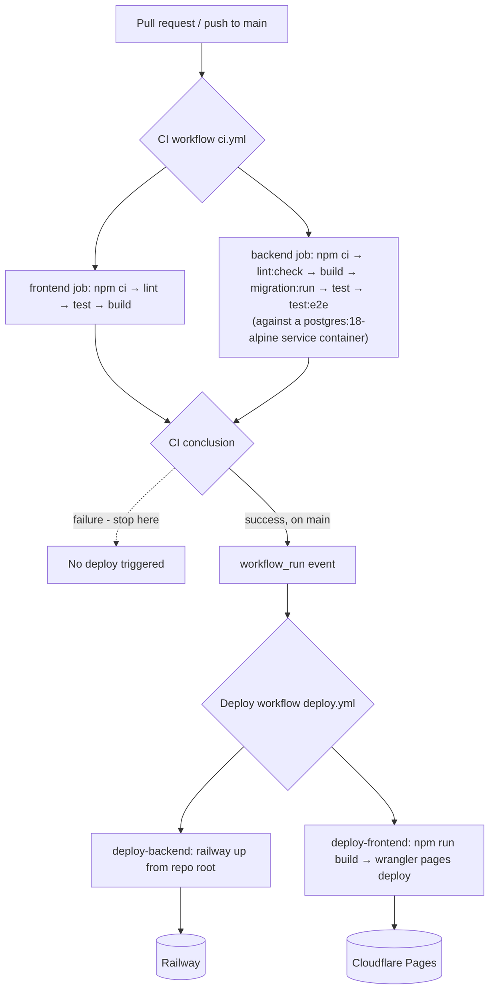

# SimpleInvoice

A full-stack invoice management application built with NestJS (backend) and React + TypeScript (frontend), backed by PostgreSQL.

---

## Live Demo

| Service     | URL                                          |
|-------------|-----------------------------------------------|
| Frontend    | https://simpleinvoice.khangtran.dev            |
| Backend API | https://api.simpleinvoice.khangtran.dev        |
| Swagger UI  | https://api.simpleinvoice.khangtran.dev/api/docs |

---

## Default Login Credentials

| Field    | Value                          |
|----------|--------------------------------|
| Email    | `reviewer@simpleinvoice.local` |
| Password | `Password123!`                 |

---

## Reviewer Quick Tour

1. **Run locally:** `./start.sh` (Docker Desktop required), then open http://localhost:3000.
2. **Or skip setup:** https://simpleinvoice.khangtran.dev - same build, same data shape.
3. **Sign in:** `reviewer@simpleinvoice.local` / `Password123!`.
4. **Highlights worth a look:**
   - Server-side money math with `Decimal.js` - [`backend/src/invoices/domain/invoice-calculation.ts`](./backend/src/invoices/domain/invoice-calculation.ts)
   - `Overdue` derived at read time, never persisted - [`backend/src/invoices/domain/derive-invoice-status.ts`](./backend/src/invoices/domain/derive-invoice-status.ts)
   - Runtime Zod validation of every API response - [`frontend/src/api/parse-api-response.ts`](./frontend/src/api/parse-api-response.ts)
   - One-command full stack - [`start.sh`](./start.sh) + [`docker-compose.yml`](./docker-compose.yml)
   - CI → gated deploy - [`.github/workflows/ci.yml`](./.github/workflows/ci.yml) and [`deploy.yml`](./.github/workflows/deploy.yml)

## Beyond the spec

These are intentional extras beyond the assessment requirements:

- **Live demo** at custom domains (Cloudflare Pages + Railway).
- **CI → gated deploy pipeline** - production deploy only fires after CI succeeds on `main` via a `workflow_run` trigger.
- **A4 print-to-PDF** without a PDF library - pure CSS `@media print` swap. See [`frontend/src/features/invoices/detail/InvoicePrintDocument.tsx`](./frontend/src/features/invoices/detail/InvoicePrintDocument.tsx).
- **Runtime Zod validation** at the frontend API boundary - every response is parsed; schema drift fails loudly. See [`frontend/src/api/invoices.schema.ts`](./frontend/src/api/invoices.schema.ts).
- **Summary dashboard endpoint** - `GET /invoices/summary` returns aggregated totals/counts respecting the same filters as `GET /invoices`. Powers the invoice list tiles.
- **`Decimal.js` precision arithmetic** - money math never touches IEEE-754 floats. See [`backend/src/invoices/domain/invoice-calculation.ts`](./backend/src/invoices/domain/invoice-calculation.ts).

---

## Project Structure

```
SimpleInvoice/
├── backend/           # NestJS REST API
├── frontend/          # React + TypeScript + Vite SPA
├── start.sh           # One-command startup script
├── stop.sh            # One-command teardown script
└── docker-compose.yml
```

This is a monorepo. Detailed documentation for each layer lives alongside the code:

- [Backend README](./backend/README.md) - API setup, migrations, testing, validation design
- [Frontend README](./frontend/README.md) - UI design decisions

---

## Quick Start (Docker)

> **Requires:** Docker Desktop running

```bash
./start.sh
```

This single command:
1. Copies `.env.example` → `.env` and `backend/.env.example` → `backend/.env` if either file does not exist
2. Builds and starts all Docker services (PostgreSQL, backend, frontend)
3. Waits for the backend to be healthy
4. Runs compiled production database migrations
5. Seeds the database with sample data
6. Waits for the frontend to be ready

Once complete, the app is available at:

| Service     | URL                              |
|-------------|----------------------------------|
| Frontend    | http://localhost:3000            |
| Backend API | http://localhost:4000            |
| Swagger UI  | http://localhost:4000/api/docs   |
| PostgreSQL  | localhost:5432                   |

To stop all services:

```bash
./stop.sh
```

Pass `--volumes` (or `-v`) to also remove the PostgreSQL data volume:

```bash
./stop.sh --volumes
```

---

## Manual Setup (Without Docker)

**Requirements:** Node.js 20+, PostgreSQL 14+

```bash
# Backend
cd backend
npm install
cp .env.example .env
# Edit .env - set POSTGRES_HOST, POSTGRES_USER, POSTGRES_PASSWORD, POSTGRES_DB
npm run migration:run
npm run seed
npm run start:dev

# Frontend (in a separate terminal)
cd frontend
npm install
cp .env.example .env
npm run dev
```

---

## Environment Variables

Docker Compose reads the root `.env` for container wiring and `backend/.env` for backend runtime secrets. Inside Docker, the backend overrides `POSTGRES_HOST` to `postgres`; for local Node.js development, use `localhost`.

| Variable            | Description                                  | Default       |
|---------------------|----------------------------------------------|---------------|
| `NODE_ENV`          | Runtime environment                          | `development` |
| `PORT`              | HTTP port the backend listens on             | `4000`        |
| `APP_PORT`          | Host port mapped to the backend container    | `4000`        |
| `FRONTEND_PORT`     | Host port mapped to the frontend container   | `3000`        |
| `POSTGRES_HOST`     | PostgreSQL host                              | -             |
| `POSTGRES_PORT`     | PostgreSQL port                              | `5432`        |
| `POSTGRES_USER`     | PostgreSQL user                              | -             |
| `POSTGRES_PASSWORD` | PostgreSQL password                          | -             |
| `POSTGRES_DB`       | PostgreSQL database name                     | -             |
| `JWT_SECRET`        | Secret for signing JWT tokens (min 32 chars) | -             |
| `JWT_EXPIRES_IN`    | Token expiry in seconds                      | `3600`        |
| `CORS_ORIGIN`       | Comma-separated allowlist of permitted origins | `http://localhost:3000,https://simpleinvoice.khangtran.dev` |

---

## Architecture Decisions

- **Monorepo** - backend and frontend share one repository for simpler reviewer setup and a single `docker-compose.yml`.
- **Migration-driven schema** - `synchronize` and `migrationsRun` are disabled in TypeORM. Schema changes are always explicit migrations, never auto-applied.
- **Customer as embedded fields** - customer data (name, email, mobile, address) is stored as columns on the `invoices` table rather than a separate `customers` table. Invoices are self-contained records; no customer identity is shared across invoices.
- **Overdue is derived, never stored** - the database only persists `Draft`, `Pending`, and `Paid`. The `Overdue` status is computed at read time when `status != Paid AND dueDate < today`.
- **UTC business date** - `today` for derived `Overdue` status is based on the UTC date to keep Docker, CI, and local runs deterministic.
- **Server-side totals** - `subTotal`, `taxAmount`, `totalAmount`, and `balanceAmount` are calculated in a pure domain function on the backend and never trusted from the client.
- **Env-driven CORS allowlist** - the backend reads `CORS_ORIGIN` (comma-separated) at boot and only accepts requests from those origins. Same env-driven pattern used for DB, JWT, and ports.
- **Summary on its own endpoint** - `GET /invoices/summary` is a separate route from `GET /invoices`. The list endpoint matches the spec response shape exactly; the dashboard tiles call the summary endpoint independently. Both honor the same filters.
- **Aggregate tiles without currency symbol** - the summary tiles on the invoice list (Total Revenue, Paid, Pending, Overdue, Draft) display plain numbers because the list supports multi-currency invoices and the tiles respond to the active status filter. Showing a currency symbol on a potentially mixed-currency sum would be misleading.

## CI/CD

Two workflows in [.github/workflows/](./.github/workflows/) drive everything from PR checks to production deploys: [ci.yml](./.github/workflows/ci.yml) and [deploy.yml](./.github/workflows/deploy.yml).



**CI** (`ci.yml`) runs on every pull request and every push to `main`:
- **Frontend job** - installs with `npm ci`, then runs `lint`, `test` (Vitest), and `build` (with `VITE_API_BASE_URL` pointed at the production API so the build step mirrors what ships).
- **Backend job** - spins up a `postgres:18-alpine` service container, then runs `lint:check` (the CI-safe, non-mutating ESLint check - `--max-warnings=0`, no `--fix`), `build`, `migration:run`, `test` (unit), and `test:e2e` against that database.

**Deploy** (`deploy.yml`) only runs after a CI run on `main` finishes, via a `workflow_run` trigger (`workflows: ["CI"]`), and every job is gated on `github.event.workflow_run.conclusion == 'success'` - a failing CI run never triggers a deploy.
- **Backend → Railway** - `railway up` is run **from the repo root**, not `backend/`, because the Railway service is already configured with `Root Directory=/backend`; uploading the full repo lets Railway apply that configured root itself. Railway's own pre-deploy step (`npm run migration:run:prod`) handles production migrations - CI's `migration:run` is only there to validate migrations apply cleanly, not to apply them to production.
- **Frontend → Cloudflare Pages** - built with `VITE_API_BASE_URL` pointed at production, then pushed with **Direct Upload** (`npx wrangler pages deploy dist --project-name simple-invoice --branch main`). This deliberately does **not** use Cloudflare's Git integration or `wrangler deploy` (that command targets Workers, not Pages).

Required GitHub repository secrets: `CLOUDFLARE_ACCOUNT_ID`, `CLOUDFLARE_API_TOKEN`, `RAILWAY_API_TOKEN`, `RAILWAY_PROJECT_ID`, `RAILWAY_SERVICE_ID`. If any of these are missing or empty, `deploy.yml` fails before starting the deploy and prints the missing secret name.

The Railway deploy pins `@railway/cli@5.2.0` so production deploys are not affected by unexpected CLI changes from the latest release.

## Known Limitations

- Only one invoice line item is supported per invoice (the data model is designed to support multiple items in the future).
- No refresh tokens - the access token is the only credential; token refresh is out of scope.
- No role-based authorization - all authenticated users have the same permissions.
