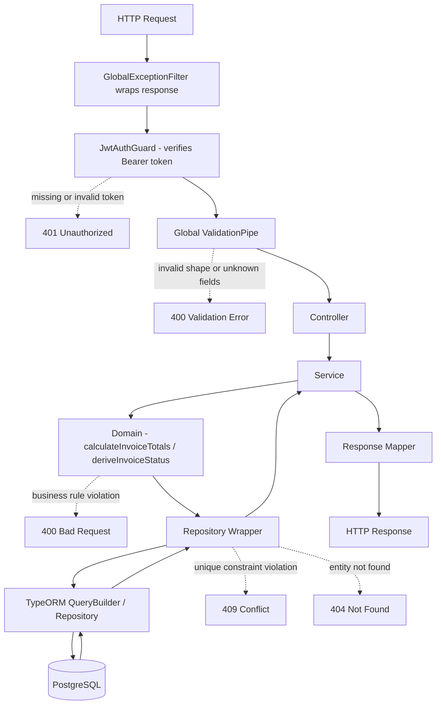
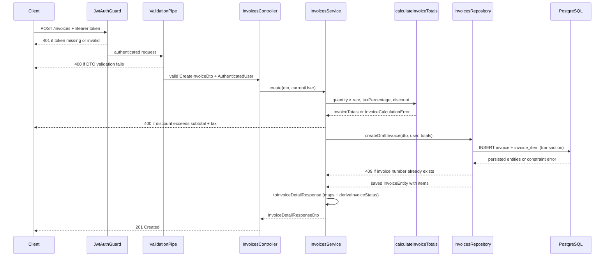
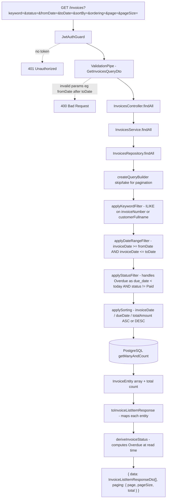
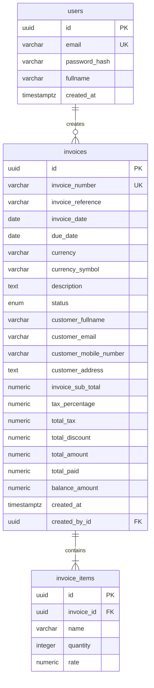

# SimpleInvoice Backend

NestJS REST API backed by PostgreSQL, TypeORM migrations, JWT authentication, class-validator input validation, Swagger/OpenAPI documentation, Jest unit tests, and Jest + Supertest E2E tests.

---

## Architecture Overview

```
src/
├── auth/          # JWT login, token issuance, JwtAuthGuard, CurrentUser decorator
├── users/         # UsersRepository, UsersService, UserEntity
├── invoices/      # InvoicesController, InvoicesService, InvoicesRepository, domain logic, DTOs, mappers
│   └── domain/    # calculateInvoiceTotals, deriveInvoiceStatus - pure business logic
├── database/      # TypeORM DataSource, migrations, seed scripts, postgres-errors util
├── health/        # HealthController (GET /health via @nestjs/terminus)
├── common/        # GlobalExceptionFilter, custom validators (IsDateOnly, IsDateOnOrAfter, IsDateRange)
└── config/        # Joi env validation, typed config factories for app/auth/database
```

**Separation of concerns:**

- **Controllers** handle the HTTP boundary: parse params, apply guards, delegate to service, return response.
- **DTOs + ValidationPipe** validate and transform request shape before the controller receives it.
- **Domain functions** hold business rules that must hold for every caller (`calculateInvoiceTotals`, `deriveInvoiceStatus`).
- **Services** orchestrate use cases: call domain functions, decide repository operations, translate errors into HTTP exceptions.
- **Repository wrappers** own all TypeORM details: query builders, filters, sorting, pagination, transactions.
- **Database constraints** are the final safety net for persisted invariants.

Derived `Overdue` status uses the UTC date as the business date boundary so status derivation is deterministic across local machines, Docker, and CI.

---

## Request Lifecycle Diagram



---

## Create Invoice Flow



---

## Invoice Listing Flow



---

## Validation Design

Validation is split across three layers so each rule lives where it is most reliable.

| Layer                | Purpose                          | Examples                                                         |
|----------------------|----------------------------------|------------------------------------------------------------------|
| DTO validation       | Validate and transform request shape | required fields, email format, date format, field ordering   |
| Domain validation    | Enforce business invariants       | discount ≤ subtotal + tax; totalPaid ≤ totalAmount              |
| Database constraints | Protect persisted data           | unique invoice number, due_date ≥ invoice_date, positive amounts |

### DTO validation

Request DTOs use `class-validator` and `class-transformer`. The global `ValidationPipe` is configured with `whitelist`, `forbidNonWhitelisted`, and `transform`. Controllers receive stripped, typed DTO instances - never raw request bodies.

- `CreateInvoiceDto` validates customer fields, dates, currency, tax, discount, and a nested `CreateInvoiceItemDto`.
- `GetInvoicesQueryDto` validates pagination, sorting, status, keyword, and date range filters.
- Cross-field checks (`dueDate >= invoiceDate`, `fromDate <= toDate`) are implemented as custom `class-validator` decorators. They skip comparison when either value is missing or already invalid to avoid duplicate error messages.

### Domain validation

Money rules live in `calculateInvoiceTotals` (`src/invoices/domain/invoice-calculation.ts`). This function uses `Decimal.js` for precision arithmetic and throws `InvoiceCalculationError` on violations. The service catches this and maps it to a 400 response. The domain function is standalone and can be called from seed scripts or future non-HTTP workflows.

### Persistence constraints

Database constraints protect invariants at the storage boundary even if a future code path bypasses the API layer. Key constraints on `invoices`: unique `invoice_number`, `due_date >= invoice_date`, and non-negative checks on all money columns. Key constraints on `invoice_items`: `quantity > 0`, `rate > 0`.

---

## Reviewer Quick Start

See the [root README](../README.md) for full setup instructions (Docker or local). This section highlights backend-specific endpoints and credentials.

### Default Credentials

Seeded automatically by `npm run seed`:

```
Email:    reviewer@simpleinvoice.local
Password: Password123!
```

### Backend Endpoints

| Resource    | URL                              |
|-------------|----------------------------------|
| Backend API | http://localhost:4000            |
| Swagger UI  | http://localhost:4000/api/docs   |
| Health      | http://localhost:4000/health     |

---

## Requirement Coverage

| Requirement                    | Status | Location                                     | How to verify                                         |
|-------------------------------|--------|----------------------------------------------|-------------------------------------------------------|
| JWT login                     | Done   | `src/auth/auth.service.ts`                   | `POST /auth/login`                                    |
| Current user profile          | Done   | `src/auth/auth.controller.ts`                | `GET /auth/me` with Bearer token                      |
| Protected invoice APIs        | Done   | `JwtAuthGuard` on `InvoicesController`       | Call `/invoices` without token → 401                  |
| Invoice listing               | Done   | `src/invoices/invoices.controller.ts`        | `GET /invoices`                                       |
| Search invoices               | Done   | `InvoicesRepository.applyKeywordFilter`      | `GET /invoices?keyword=Paul` (number or name)         |
| Filter by status              | Done   | `InvoicesRepository.applyStatusFilter`       | `GET /invoices?status=Overdue`                        |
| Filter by date range          | Done   | `InvoicesRepository.applyDateRangeFilter`    | `GET /invoices?fromDate=2026-01-01&toDate=2026-06-30` |
| Sort invoices                 | Done   | `InvoicesRepository.applySorting`            | `GET /invoices?sortBy=totalAmount&ordering=ASC`       |
| Server-side pagination        | Done   | `InvoicesRepository.buildFindAllQuery`       | Response includes `paging.total`, `paging.page`       |
| Summary dashboard endpoint    | Extra  | `InvoicesService.findSummary`                | `GET /invoices/summary` (honors same filters as `/invoices`) |
| Invoice detail                | Done   | `src/invoices/invoices.service.ts`           | `GET /invoices/:id`                                   |
| Create invoice                | Done   | `src/invoices/invoices.service.ts`           | `POST /invoices`                                      |
| Server-side total calculation | Done   | `src/invoices/domain/invoice-calculation.ts` | `npm run test` → `invoice-calculation.spec.ts`        |
| Unique invoice number         | Done   | DB constraint + service error mapping        | Duplicate `invoiceNumber` → 409 Conflict              |
| Due date validation           | Done   | DTO `@IsDateOnOrAfter` + DB constraint       | `dueDate` before `invoiceDate` → 400                  |
| Overdue derived status        | Done   | `src/invoices/domain/derive-invoice-status.ts` | Unpaid invoice past due date returns `Overdue`      |
| Swagger docs                  | Done   | Swagger decorators on all controllers        | http://localhost:4000/api/docs                        |
| Unit tests                    | Done   | `src/**/*.spec.ts`                           | `npm run test`                                        |
| E2E tests                     | Done   | `test/*.e2e-spec.ts`                         | `npm run test:e2e`                                    |

---

## API Documentation

Swagger UI is available at **http://localhost:4000/api/docs**.

Reviewer flow:

1. Call `POST /auth/login` with the credentials above.
2. Copy the `accessToken` from the response.
3. Click **Authorize** in the top-right of Swagger UI.
4. Paste the token value (Swagger prefixes `Bearer` automatically).
5. All protected invoice endpoints are now callable.

---

## Environment Configuration

Copy `backend/.env.example` to `backend/.env` and fill in the required values.

| Variable            | Required | Default       | Description                                      |
|---------------------|----------|---------------|--------------------------------------------------|
| `NODE_ENV`          | No       | `development` | Runtime environment                              |
| `PORT`              | No       | `4000`        | HTTP port                                        |
| `POSTGRES_HOST`     | Yes      | -             | PostgreSQL hostname                              |
| `POSTGRES_PORT`     | Yes      | -             | PostgreSQL port (typically `5432`)               |
| `POSTGRES_DB`       | Yes      | -             | Database name                                    |
| `POSTGRES_USER`     | Yes      | -             | Database user                                    |
| `POSTGRES_PASSWORD` | Yes      | -             | Database password                                |
| `JWT_SECRET`        | Yes      | -             | Signing secret, minimum 32 characters            |
| `JWT_EXPIRES_IN`    | No       | `3600`        | Token lifetime in seconds                        |
| `CORS_ORIGIN`       | No       | `http://localhost:3000` | Comma-separated allowlist of permitted origins |

The app validates all required variables at startup using Joi and exits immediately with a descriptive error if any are missing or malformed.

E2E tests can either use `npm run test:e2e:docker` for a temporary Docker PostgreSQL instance or a separate `backend/.env.test` file pointing to a dedicated test database. Use `.env.test.example` as the starting point for local test DB configuration.

---

## Database and Migrations

The schema is migration-driven. `synchronize` and `migrationsRun` are disabled in TypeORM - schema changes only happen through explicit migrations.

```bash
npm run migration:run                                                       # apply pending migrations
npm run migration:run:prod                                                  # apply compiled dist migrations
npm run migration:show                                                      # list applied vs pending
npm run migration:generate -- src/database/migrations/NameOfMigration      # generate from entity diff
npm run migration:revert                                                    # revert last migration
npm run seed                                                                # seed reviewer user + 30 sample invoices
npm run seed:prod                                                           # seed from compiled dist
```

Run migrations before seeding. The seed script uses upsert for the reviewer user so it is safe to run multiple times.

---

## Testing

```bash
npm run test          # unit tests
npm run test:e2e      # end-to-end tests (requires .env.test and a running PostgreSQL)
npm run test:e2e:docker # start test PostgreSQL in Docker, then run end-to-end tests
npm run test:cov      # unit tests with coverage report
```

### Unit tests (`src/**/*.spec.ts`)

Unit tests use Jest and `@nestjs/testing`. Each spec wires only the class under test and replaces every dependency with a typed `jest.Mocked` partial. Guards are swapped via `overrideGuard`.

| Area                  | File                                          | What it verifies                                                          |
|-----------------------|-----------------------------------------------|---------------------------------------------------------------------------|
| Auth service          | `auth/auth.service.spec.ts`                   | Login flow, credential validation, token issuance                         |
| Auth controller       | `auth/auth.controller.spec.ts`                | Delegation to service; `getMe` with mocked guard                          |
| JWT guard             | `auth/guards/jwt-auth.guard.spec.ts`          | Valid token, missing/malformed/expired token, revoked user                |
| Access token service  | `auth/services/access-token.service.spec.ts`  | JWT signing and expiry config                                             |
| Password utility      | `auth/utils/password.util.spec.ts`            | `bcrypt.compare` delegation                                               |
| Auth response mapper  | `auth/mappers/auth-user-response.mapper.spec.ts` | `passwordHash` is never exposed                                        |
| Invoices service      | `invoices/invoices.service.spec.ts`           | `findAll`, `findOne`, `create`; conflict on duplicate number; domain validation failure |
| Invoices controller   | `invoices/invoices.controller.spec.ts`        | Delegation to service with mocked guard                                   |
| Invoice calculation   | `invoices/domain/invoice-calculation.spec.ts` | Subtotal, tax, discount, paid, balance rounding (Decimal.js); over-discount and over-paid validation |
| Users service         | `users/user.service.spec.ts`                  | Email normalisation, lookup by ID, null handling                          |
| Date validators       | `common/validators/date-only.validator.spec.ts` | `IsDateOnly`, `IsDateOnOrAfter`, `IsDateRange` - format and ordering rules |
| Postgres error util   | `database/postgres-errors.util.spec.ts`       | `isUniqueViolation` identifies unique constraint errors by constraint name |

### E2E tests (`test/*.e2e-spec.ts`)

E2E tests boot a real NestJS application against a dedicated PostgreSQL database. TypeORM migrations run during setup. Each suite truncates all tables in `beforeAll` for isolation.

| Suite            | File                     | Scenarios                                                                           |
|------------------|--------------------------|-------------------------------------------------------------------------------------|
| Health           | `app.e2e-spec.ts`        | `GET /health` returns 200                                                           |
| Auth             | `auth.e2e-spec.ts`       | Login → 200 + JWT; invalid password → 401; email validation → 400; `GET /auth/me` with valid/missing/malformed token |
| Invoices (create) | `invoices.e2e-spec.ts`  | Full payload → 201 + computed totals; minimal fields → 201; duplicate number → 409; missing required field → 400; no token → 401 |
| Invoices (list)   | `invoices.e2e-spec.ts`  | Default pagination; keyword filter; date range filter; invalid date range → 400; page 2; no token → 401 |
| Invoices (detail) | `invoices.e2e-spec.ts`  | Known ID → 200; non-existent UUID → 404; invalid UUID → 400; no token → 401        |

---

## Service and Repository Design

Services orchestrate use cases; repository wrappers own TypeORM.

**Services** call domain functions, decide which repository operation to run, translate persistence or domain errors into HTTP exceptions, and map entities into response DTOs. They do not build SQL queries or manage transactions directly.

**Repository wrappers** (`InvoicesRepository`, `UsersRepository`) inject TypeORM repositories via `@InjectRepository`, build query builders, apply filters/sorting/pagination, and save related entities inside a `DataSource.transaction`. Wrapper classes are used instead of extending TypeORM `Repository` so they are easy to register with Nest DI and make transaction boundaries explicit.

---

## Error Handling

All responses go through `GlobalExceptionFilter`, which adds `timestamp` and `path` to every error body and logs unexpected errors server-side.

| Scenario                    | HTTP status | Trigger                                  |
|-----------------------------|-------------|------------------------------------------|
| DTO validation failure      | 400         | `ValidationPipe` fails                   |
| Business rule violation     | 400         | `InvoiceCalculationError` from domain    |
| Missing or invalid token    | 401         | `JwtAuthGuard` rejects                   |
| Invoice not found           | 404         | `NotFoundException` in service           |
| Duplicate invoice number    | 409         | Unique constraint → `ConflictException`  |
| Unexpected server error     | 500         | Logged; message hidden in production     |

Example 400 body (validation):

```json
{
  "statusCode": 400,
  "message": ["dueDate must be on or after invoiceDate"],
  "error": "Bad Request",
  "timestamp": "2026-06-27T10:00:00.000Z",
  "path": "/invoices"
}
```

---

## Security Notes

- Passwords are hashed with bcrypt (12 rounds). `passwordHash` is never returned in any response.
- JWT tokens are signed with `JWT_SECRET` (minimum 32 characters) and expire after `JWT_EXPIRES_IN` seconds (default 3600).
- All `/invoices` endpoints require a valid Bearer token via `JwtAuthGuard`.
- The login endpoint is rate-limited to 5 requests per 60 seconds (`@nestjs/throttler`).
- `ValidationPipe` with `whitelist: true` and `forbidNonWhitelisted: true` rejects unknown fields on every request.
- All secrets are loaded from environment variables; none are hard-coded.
- CORS uses an env-driven allowlist (`CORS_ORIGIN`, comma-separated). Requests from non-allowlisted origins are rejected.

---

## Database Design

Three tables managed by TypeORM migrations. `synchronize` is disabled.

### `users`

| Column          | Type           | Constraints             |
|-----------------|----------------|-------------------------|
| `id`            | uuid           | PK                      |
| `email`         | varchar(255)   | Unique (`uq_users_email`) |
| `password_hash` | varchar(255)   | -                       |
| `fullname`      | varchar(255)   | -                       |
| `created_at`    | timestamptz    | auto                    |

### `invoices`

| Column               | Type             | Constraints                                      |
|----------------------|------------------|--------------------------------------------------|
| `id`                 | uuid             | PK                                               |
| `invoice_number`     | varchar(100)     | Unique (`uq_invoices_invoice_number`)            |
| `invoice_reference`  | varchar(100)     | nullable                                         |
| `invoice_date`       | date             | -                                                |
| `due_date`           | date             | `due_date >= invoice_date` check constraint      |
| `currency`           | varchar(3)       | -                                                |
| `currency_symbol`    | varchar(8)       | -                                                |
| `description`        | text             | nullable                                         |
| `status`             | enum             | Draft / Pending / Paid (default Draft)           |
| `customer_fullname`  | varchar(255)     | -                                                |
| `customer_email`     | varchar(255)     | -                                                |
| `customer_mobile_number` | varchar(50) | nullable                                         |
| `customer_address`   | text             | nullable                                         |
| `invoice_sub_total`  | numeric(14,2)    | `>= 0` check                                     |
| `tax_percentage`     | numeric(5,2)     | `>= 0` check                                     |
| `total_tax`          | numeric(14,2)    | `>= 0` check                                     |
| `total_discount`     | numeric(14,2)    | `>= 0` check                                     |
| `total_amount`       | numeric(14,2)    | `>= 0` check                                     |
| `total_paid`         | numeric(14,2)    | `>= 0` check                                     |
| `balance_amount`     | numeric(14,2)    | `>= 0` check                                     |
| `created_at`         | timestamptz      | auto                                             |
| `created_by_id`      | uuid             | FK → `users.id` (RESTRICT on delete)            |

### `invoice_items`

| Column       | Type          | Constraints                          |
|--------------|---------------|--------------------------------------|
| `id`         | uuid          | PK                                   |
| `invoice_id` | uuid          | FK → `invoices.id` (CASCADE delete)  |
| `name`       | varchar(255)  | -                                    |
| `quantity`   | integer       | `> 0` check                          |
| `rate`       | numeric(14,2) | `> 0` check                          |

### Entity relationship diagram



---

## Known Limitations

- **One line item per invoice.** The data model supports multiple `invoice_items` rows per invoice, but the `POST /invoices` API currently accepts exactly one `item`. This matches the assessment scope.
- **Overdue is derived, not persisted.** The database stores only `Draft`, `Pending`, and `Paid`. `Overdue` is computed at read time when `status != Paid AND dueDate < today`. No background job is needed.
- **No refresh tokens.** The access token is the only credential. Token refresh is out of scope for this assessment.
- **No role-based authorization.** All authenticated users have the same permissions. RBAC is out of scope.
- **No email delivery or payment integration.** Invoice creation and status transitions are data-only operations.
- **Customer is embedded on the invoice.** Customer data (name, email, mobile, address) is stored as columns on `invoices` rather than a separate `customers` table. Invoices are self-contained records; there is no shared customer identity across invoices.
