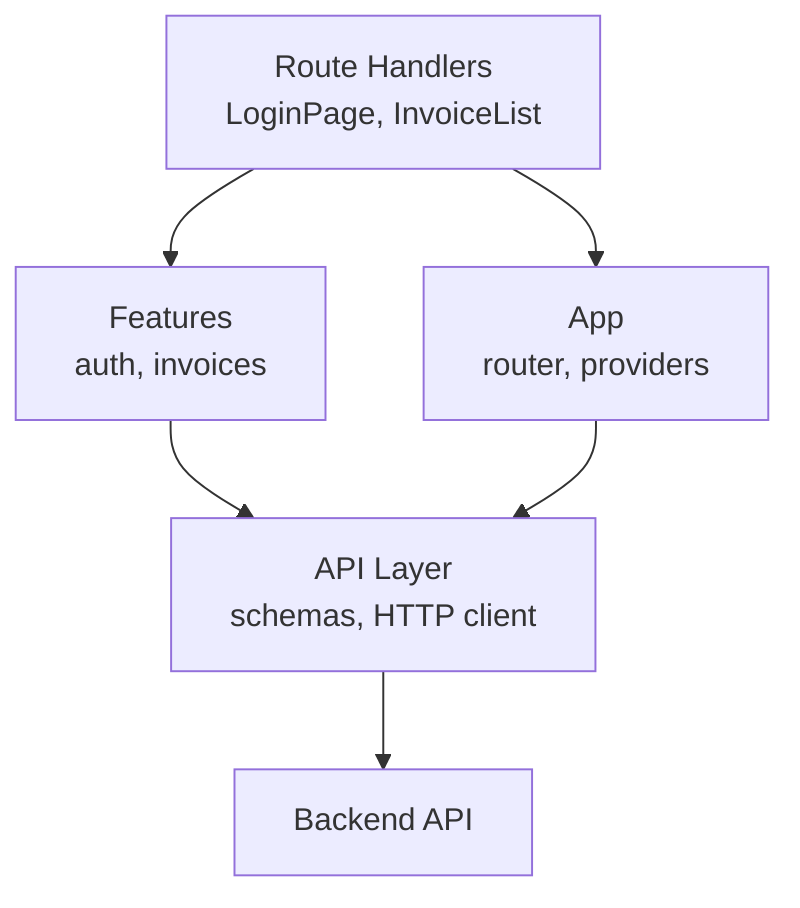
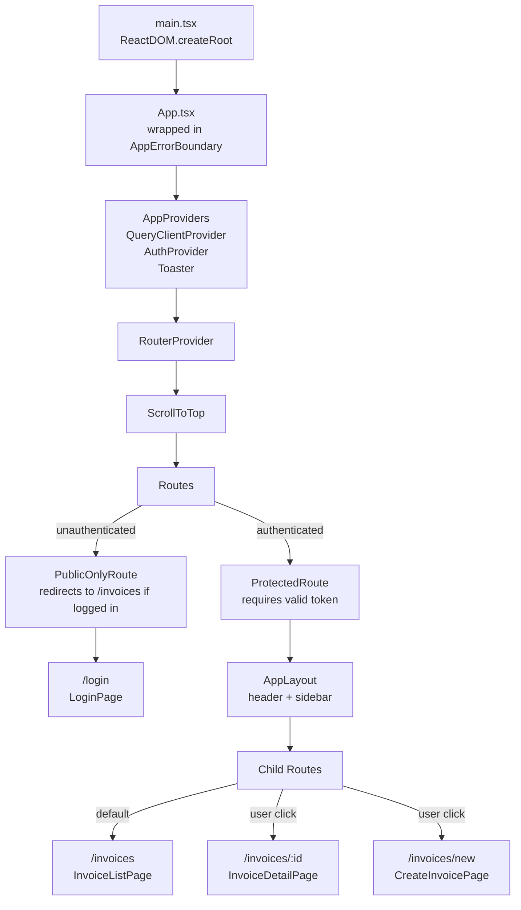
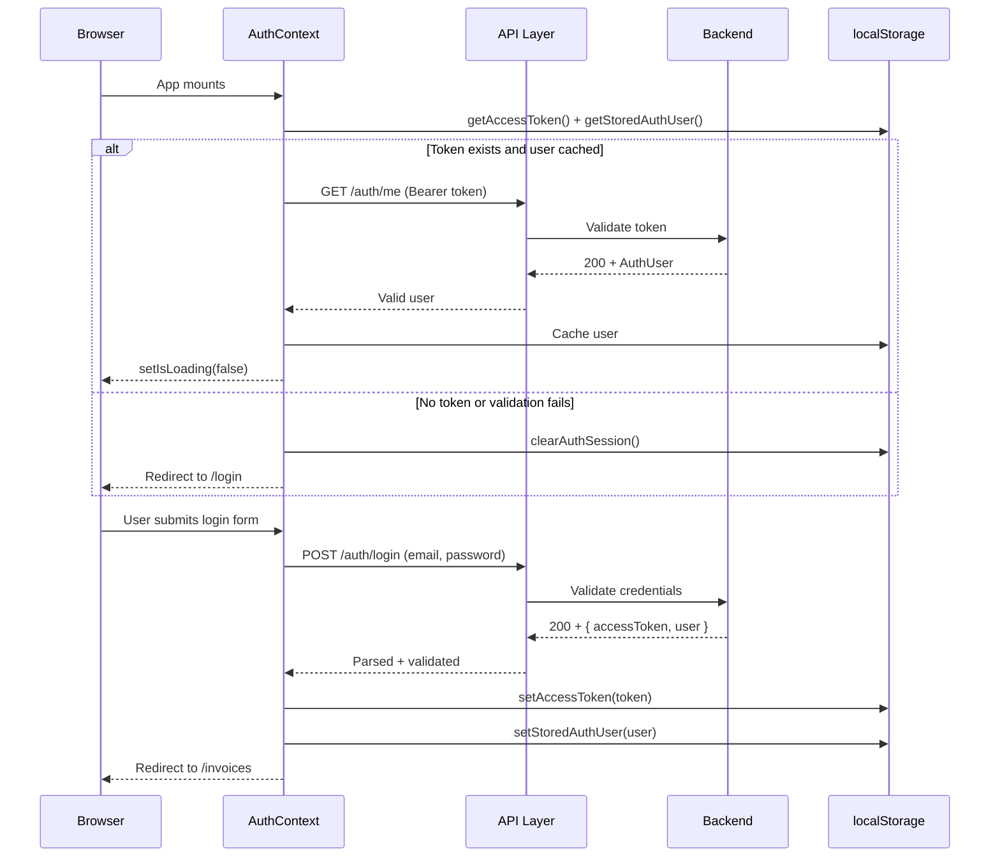
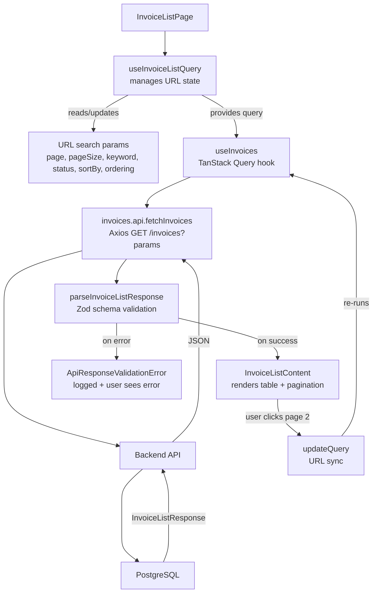
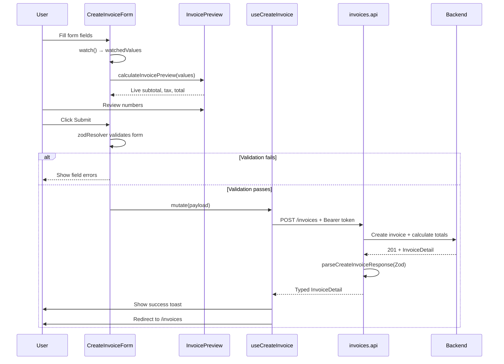
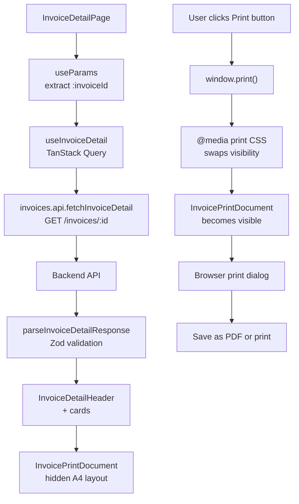

# SimpleInvoice - Frontend

React 19 + TypeScript + Vite frontend for the SimpleInvoice assessment application. Fully responsive, feature-first architecture with runtime API validation, comprehensive test coverage, and polished UX.

---

## Reviewer Quick Summary

**What to look for:**

- **Protected Routes & Authentication** - Login redirects to invoice list on success; all invoice routes require valid JWT; logout clears session. See `auth-context.tsx`, `ProtectedRoute.tsx`.
- **Invoice List** - Paginated, searchable, filterable by status (Draft/Pending/Paid/Overdue), sortable by date/amount. List state lives in URL query params. See `InvoiceListPage.tsx`, `use-invoice-list-query.ts`.
- **Invoice Detail** - Full invoice information, line items, totals, payment status. Includes a **print-to-PDF** feature that produces an A4 document without external dependencies. See `InvoiceDetailPage.tsx`, `InvoicePrintDocument.tsx`.
- **Create Invoice** - Multi-field form with real-time validation and a live preview panel. Backend validates totals; frontend shows preview. One line item per assessment spec. See `CreateInvoiceForm.tsx`, `createInvoiceSchema.ts`.
- **Runtime Response Validation** - Zod schemas validate all API responses at unsafe boundaries (login, invoice list/detail, create). Parsing errors are caught and logged. See `invoices.schema.ts`, `auth.schema.ts`, `parse-api-response.ts`.
- **Comprehensive Tests** - tests cover form validation, hooks, utilities, component behavior, and runtime schema validation. MSW mocks backend; factories generate test data. Run `npm run test` for the full suite. See `frontend/src/**/*.test.ts`, `test/mocks/`.
- **Feature-First Architecture** - Code organized by feature (`auth`, `invoices`) with feature-local domain logic, not by layer. Shared utilities live in `shared/`. See folder structure below.

---

## Tech Stack

| Layer            | Technology       | Purpose                                           |
|------------------|------------------|---------------------------------------------------|
| **Build**        | Vite 8           | Fast bundler and dev server                       |
| **Framework**    | React 19         | Component library                                 |
| **Language**     | TypeScript 6.0   | Static type safety                                |
| **Routing**      | React Router 8   | Client-side navigation and route guards           |
| **HTTP**         | Axios 1.18       | HTTP client with interceptors                     |
| **Server State** | TanStack Query 5 | Server-state caching, fetching, mutations         |
| **Form State**   | React Hook Form 7 | Form lifecycle, validation errors, async submit   |
| **Validation**   | Zod 4.4          | Runtime schema validation (API responses, forms)  |
| **Styling**      | Tailwind CSS 4   | Utility-first CSS, responsive design              |
| **UI Icons**     | Lucide React 1.2 | Consistent icon library                           |
| **Notifications** | Sonner 2.0       | Toast notifications (success, error)              |
| **Testing**      | Vitest 4.1       | Unit and component tests                          |
| **Test Utils**   | Testing Library 6 | React component testing queries                    |
| **API Mocking**  | MSW 2.14         | Mock Service Worker for API mocking in tests      |
| **Linting**      | ESLint 10        | Code quality and consistency                      |

---

## Architecture Overview

### Dependency Direction

Features are **loosely coupled** and depend only on the API and shared layers:



**Feature-first organization:**

- Each feature owns its domain logic, hooks, schemas, and components.
- Features do not import from other features.
- Shared utilities (format, UI controls) live in `shared/`, not duplicated.
- Tests live adjacent to the code they test (e.g., `login.schema.test.ts` next to `login.schema.ts`).

---

## Frontend Request/Data Flow

### 1. App Bootstrap and Route Composition



### 2. Auth Login and Session Restore



### 3. Invoice List Data Flow



### 4. Create Invoice Form Submission



### 5. Invoice Detail and Print



---

## Validation Strategy

Validation happens at **unsafe boundaries** where external data enters:

| Boundary                  | Tool          | Example                                   |
|---------------------------|---------------|-------------------------------------------|
| **API Response**          | Zod schema    | `parseLoginResponse()` after `POST /auth/login` |
| **Form Input**            | Zod schema    | `createInvoiceSchema` before submit       |
| **URL Query Params**       | `useInvoiceListQuery` | Parse & normalize `page`, `status`        |
| **Stored Auth Session**   | Zod schema    | `authUserSchema` when restoring from localStorage |

**Why Zod?**

- **Type narrowing** - After validation, TypeScript knows the shape is safe.
- **Composition** - Schemas are reusable and composable.
- **Error reporting** - Clear, structured validation errors.
- **Assertion at boundaries** - Only validate where data is untrusted (API, user input, storage).

**Example:** Backend sends `{ totalAmount: "123.45" }` (string, not number). Zod schema specifies `numericStringSchema`, which accepts strings and coerces to numbers in JS. If backend sends `{ totalAmount: "not-a-number" }`, validation fails loudly.

---

## State Management Strategy

| State Type          | Tool                | Where                                | Why                                      |
|---------------------|---------------------|--------------------------------------|------------------------------------------|
| **Server State**     | TanStack Query      | `useInvoices`, `useInvoiceDetail`   | Caching, background refetches, stale-time |
| **Form State**       | React Hook Form     | `useForm` in CreateInvoiceForm      | Field-level validation, async submit     |
| **Auth Session**     | React Context       | `AuthProvider`, `useAuth()`         | Global availability, logout broadcast   |
| **List Query State** | URL search params   | `useInvoiceListQuery`               | Sharable via URL, survives refresh       |
| **Component State**  | React `useState`    | Local component state               | Temporary UI state (modal open, etc)     |

**No Redux, no Zustand.** The app is small enough that these primitives handle it:

- TanStack Query removes the need for global server-state management.
- React Hook Form keeps form state local and efficient.
- React Context is used sparingly (auth only).
- URL params are the "database" for invoice list state.

---

## Testing Strategy

### Unit Tests

Pure functions tested in isolation:

- **Form schemas** - Zod schema validation with valid/invalid inputs.
- **Mappers** - `invoice-detail.mapper.ts` transforms API response to view model.
- **Utilities** - `format.ts`, `api-error.ts`, etc.
- **Hooks** - Query hooks return expected shapes, error handling.

### Component Tests

React components tested with `@testing-library/react`:

- **Form controls** - Render, interact (type, select, submit), verify errors.
- **Invoice status badge** - Render with different statuses, verify color/label.
- **List components** - Render with mock data, verify UI updates on prop changes.

### Integration Tests

Full workflows with MSW mocking:

- **Login → redirect to list** - Session state flows through.
- **Create invoice → appears in list** - Mutation + list refetch.
- **Filter, sort, paginate** - URL state and query synced.

### Test Data

**Factories** generate realistic data on demand:

```ts
const invoice = invoiceFactory.build({ status: 'Paid' });
const user = authFactory.build({ email: 'test@example.com' });
```

**Fixtures** provide pre-built common responses (e.g., successful login, list of 5 invoices).

---

## Design Decisions

### 1. Feature-First Folder Structure

**Decision:** Organize by feature (auth, invoices) instead of by layer (components, hooks, utils).

**Why:**
- Each feature is self-contained; easy to understand in isolation.
- Feature-local logic (schemas, mappers, hooks) lives together.
- Reduces cross-feature dependencies.
- Clear ownership and easier to add/remove features.

**Trade-off:** Some duplication of similar patterns across features. Acceptable for this scope.

---

### 2. Runtime API Response Validation

**Decision:** Validate every API response with Zod at the call site.

**Why:**
- **Defensive** - Catch unexpected API changes immediately.
- **Type-safe** - After validation, TypeScript knows the shape.
- **Observable** - Validation errors logged with endpoint name; easy to debug.
- **Cheap** - Zod validation is fast; negligible performance impact.

**Trade-off:** Verbose schema definitions. Offset by reusability and safety.

---

### 3. Backend as Source of Truth for Totals

**Decision:** Form shows a live *preview* of subtotal/tax/total, but does NOT send calculations to backend.

**Why:**
- **Correctness** - Backend recalculates independently; no rounding or precision bugs.
- **Auditability** - Backend is the single source of truth for money.
- **Simplicity** - Frontend doesn't need to replicate complex money math.

**Implementation:**
- `create-invoice-calculations.ts` - Client-side preview (uses same formula as backend for UX consistency).
- Backend `calculateInvoiceTotals()` - Validates and applies actual totals.

---

### 4. Print Invoice Without PDF Library

**Decision:** Print invoice using browser `window.print()` and CSS media queries; no external PDF library.

**Why:**
- **Zero dependency** - No extra library to bundle.
- **Native** - Works in all modern browsers without setup.
- **Familiar** - Users expect `Ctrl+P` / `Cmd+P` to work.
- **A4-ready** - CSS handles page size, margins, breaks.

**Implementation:**
- `InvoicePrintDocument.tsx` - A4-sized hidden layout.
- `index.css` - `@media print` rule hides app shell, shows print document.
- `page-break-inside: avoid` prevents table/totals from splitting across pages.

---

### 5. URL Search Params as Invoice List State

**Decision:** Pagination, sorting, filtering, and search state lives in the URL, not in React state.

**Why:**
- **Sharable** - Copy URL → share filtered list with colleague.
- **Bookmarkable** - Refresh page → state preserved.
- **Debuggable** - Query state visible in address bar.
- **Lightweight** - No global state management needed.

**Implementation:**
- `use-invoice-list-query.ts` - Reads/writes URL search params.
- `updateQuery()` → updates param and re-fetches.
- `resetQuery()` → clears filters.

---

### 6. Keeping List/Create/Detail Workflows Separated

**Decision:** Three separate routes and page components, not a shared modal or tab interface.

**Why:**
- **Clear entry/exit** - Each route has clear URL and purpose.
- **No state leakage** - Create form doesn't affect list state until redirect.
- **Mobile-friendly** - Full-screen experience on small screens.
- **Accessible** - Clear navigation flow with browser back button.

---

### 7. Summary Tiles Without Dynamic Currency Symbol

**Decision:** Summary tiles show plain numbers (e.g., `94,737.54`) without currency symbol.

**Why:**
- **Accuracy** - Totals may span multiple currencies; no single symbol is correct.
- **Consistency** - Symbol doesn't flicker as user changes status filter.
- **Clarity** - Avoids confusion if invoice mix is multi-currency.

---

### 8. Shared Form Controls in `shared/ui/form`

**Decision:** Reusable form inputs (TextInput, SelectInput, etc) live in `shared/`, not duplicated per feature.

**Why:**
- **DRY** - Single source of truth for form control styling and behavior.
- **Consistency** - All forms look and feel the same.
- **Easier to refactor** - Update styling in one place.

---

## Scripts

### Frontend-Only Commands

```bash
# Development
npm run dev                 # Start Vite dev server (http://localhost:5173)
npm run build              # TypeScript check + Vite bundle
npm run preview            # Preview production build locally
npm run lint               # Run ESLint

# Testing
npm run test               # Run Vitest once
npm run test:watch         # Run Vitest in watch mode
npm run test:coverage      # Generate coverage report (HTML in coverage/)
```

See root `README.md` for full-stack setup (Docker, backend, database).

---

## Requirement Coverage

| Requirement                    | Status | Location                                   | How to Verify                              |
|--------------------------------|--------|--------------------------------------------|--------------------------------------------|
| React + TypeScript             | Done   | `src/` (all files `.tsx`, `.ts`)          | `npm run build` succeeds with no errors    |
| Responsive design              | Done   | `index.css`, Tailwind config, components | Open in mobile/tablet viewport             |
| Login screen                   | Done   | `src/features/auth/login/`                | Navigate to `/login`                       |
| Email + password input         | Done   | `LoginPage.tsx`                           | Login form has both fields                 |
| Client + server validation     | Done   | `login.schema.ts` + backend               | Invalid email → error; valid → submit OK   |
| JWT storage + usage            | Done   | `auth-storage.ts`, `http-client.ts`       | Token in `localStorage.auth_token`         |
| Redirect to login if not auth  | Done   | `ProtectedRoute.tsx`                      | Access `/invoices` without token → redirect to `/login` |
| Invoice list on login          | Done   | `src/features/invoices/list/`             | After login, redirects to `/invoices`      |
| Paginated list                 | Done   | `InvoiceListContent.tsx`, `useInvoices`   | Pagination controls show; click pages      |
| List fields (number, name, date, total, status) | Done | `InvoiceListContent.tsx` columns | All columns visible                        |
| Search (invoice number, customer name) | Done | `useInvoiceListQuery` + backend | Type in search input; list filters         |
| Filter by status               | Done   | `InvoiceSummaryTiles.tsx` status tabs     | Click "Paid", "Overdue", etc.; list updates |
| Sort by date/amount            | Done   | `InvoiceListContent.tsx` column headers   | Click column header; sort order toggles    |
| Pagination query params        | Done   | URL search params                          | `?page=2&pageSize=10` in URL               |
| Invoice detail                 | Done   | `src/features/invoices/detail/`           | Click invoice row; detail page loads       |
| Detail shows customer, items, totals | Done | `InvoiceDetailPage.tsx` + cards | All sections visible on detail page        |
| Create invoice form            | Done   | `src/features/invoices/create/`           | Click "Create Invoice" button               |
| Customer fields                | Done   | `CustomerInformationFields.tsx`           | Name, email, mobile, address fields        |
| Invoice date + due date        | Done   | `InvoiceInformationFields.tsx`            | Both date pickers present                  |
| Item name + quantity + rate    | Done   | `InvoiceItemFields.tsx`                   | One item section with all fields           |
| Tax % (default 10%)            | Done   | `create-invoice.defaults.ts`              | Default is `10`, user can change           |
| Discount (default 0)           | Done   | `create-invoice.defaults.ts`              | Default is `0`, user can change            |
| Form validation errors         | Done   | `createInvoiceSchema` + `CreateInvoiceForm` | Leave required field empty → error shows   |
| Success notification           | Done   | `CreateInvoiceForm.tsx` → `toast.success` | After create, success toast appears        |
| Redirect to list on create     | Done   | `CreateInvoiceForm.tsx` → `navigate()`    | After create, redirected to `/invoices`    |
| Server-side total calculation  | Done   | Backend (verified in detail response)     | Frontend never sends calculated totals     |
| Backend as calculation source  | Done   | Form preview vs API response            | Preview ≠ API total → API total is used   |
| Unit tests                     | Done   | `src/**/*.test.ts`                        | `npm run test` passes                      |
| Component/behavior tests       | Done   | `src/**/*.test.tsx` + MSW mocks           | `npm run test:coverage` shows coverage     |

---

## Known Limitations

### Frontend-Specific

- **JWT in localStorage** - Token stored in localStorage for assessment simplicity. A production app would use httpOnly cookies and refresh token rotation.
- **One line item per invoice** - Form supports exactly one item per the requirement. Data model allows multiple items for future expansion, but `POST /invoices` enforces one item.
- **Print engine dependency** - Print output depends on browser and printer driver. Some printers may not honor `print-color-adjust: exact`; status badge colors may not print as expected on all devices.
- **No refresh token** - Expired tokens require re-login. Token lifetime is configurable by `JWT_EXPIRES_IN` env var on backend.
- **Summary tiles span all currencies** - Multi-currency invoices may exist; summary tiles intentionally don't display a single currency symbol. See "Design Decisions" section.

---

## Integration with Backend

The frontend assumes the backend API at the URL specified in `VITE_API_URL` env var (default: `http://localhost:4000`).

**Required backend endpoints:**

| Method | Endpoint              | Auth | Response                                   |
|--------|-----------------------|------|---------------------------------------------|
| POST   | `/auth/login`         | No   | `{ accessToken, tokenType, expiresIn, user }` |
| GET    | `/auth/me`            | Yes  | `{ id, email, fullname }`                  |
| GET    | `/invoices`           | Yes  | `{ data: [...], paging }`                  |
| GET    | `/invoices/summary`   | Yes  | `{ totalRevenue, totalPaid, ...counts, currency }` - honors same filters as `/invoices` |
| GET    | `/invoices/:id`       | Yes  | `{ id, invoiceNumber, customer, items, ...}` |
| POST   | `/invoices`           | Yes  | `{ id, invoiceNumber, customer, items, ...}` |

See backend README (`backend/README.md`) for endpoint details, query params, and error codes.

---

## Code Quality

- **TypeScript strict mode** - All code is typed; no `any`.
- **ESLint** - Enforces React hooks rules, unused variables, imports.
- **Vitest** - 25 test files; coverage for critical paths.
- **Responsive design** - Tested on mobile, tablet, desktop.

---

## Architecture Principles

1. **Type safety first** - TypeScript strict mode; Zod validation at boundaries.
2. **Single responsibility** - Each function/component does one thing.
3. **Testability** - Logic is isolated; components are small and focused.
4. **Accessibility** - Semantic HTML, ARIA labels, keyboard navigation.
5. **Performance** - TanStack Query caches; React Router lazy-loads routes (future).
6. **Maintainability** - Clear folder structure; feature-first organization.
